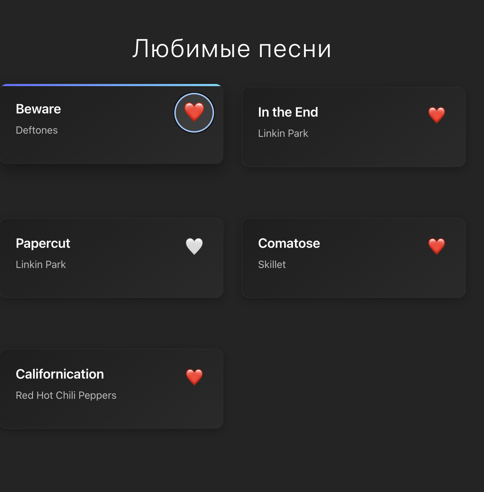
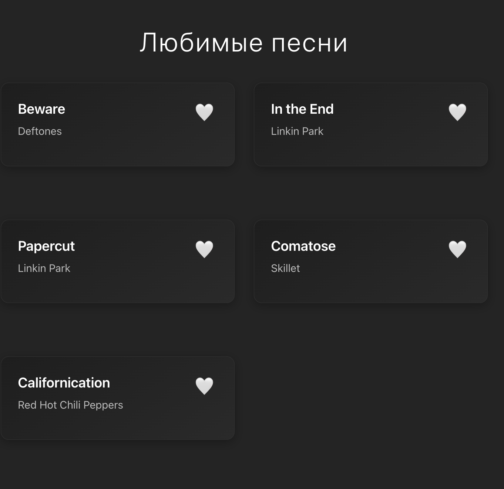

# TIP - Любимые песни
Веб-приложение для управления плейлистом любимых песен с возможностью добавления/удаления из избранного.

## Описание проекта

TIP - это современное веб-приложение, созданное на React, которое позволяет пользователям управлять коллекцией любимых песен. Приложение имеет темную тему оформления и интуитивно понятный интерфейс с карточками песен.

## Технологии

- **React 19.2.0** - основная библиотека для создания пользовательского интерфейса
- **Vite 7.2.4** - инструмент сборки для быстрой разработки
- **CSS3** - стилизация с использованием современных CSS-функций
- **ESLint** - линтер для поддержания качества кода

## Функциональность

- Отображение коллекции песен в виде карточек
- Переключение статуса "избранное" для каждой песни (❤️/🤍)
- Ссылки на YouTube для прослушивания песен
- Адаптивный дизайн для различных размеров экранов
- Плавные анимации при взаимодействии

## Дизайн

Приложение использует темную цветовую схему с градиентными эффектами:
- Основной фон: `#242424`
- Карточки: градиент от `#1e1e1e` до `#2a2a2a`
- Акцентные цвета: `#646cff` и `#61dafb`
- Анимации hover-эффектов и heartBeat для кнопки избранного

## Скриншоты

### Главная страница


### Добавление в избранное  


### Удаление из избранного


## Установка и запуск

1. Клонируйте репозиторий:
```bash
git clone https://github.com/Ex1s9/TIP.git
cd tip
```

2. Установите зависимости:
```bash
npm install
```

3. Запустите проект в режиме разработки:
```bash
npm run dev
```

4. Откройте [http://localhost:5173](http://localhost:5173) в браузере

## Структура проекта

```
tip/
├── public/          # Статические файлы
├── src/
│   ├── App.jsx      # Главный компонент приложения
│   ├── App.css      # Стили компонента App
│   ├── main.jsx     # Точка входа приложения
│   └── index.css    # Глобальные стили
├── screen/          # Скриншоты приложения
├── package.json     # Зависимости и скрипты
└── vite.config.js   # Конфигурация Vite
```

## Особенности реализации

- **State Management**: Использует React Hooks (useState) для управления состоянием
- **Responsiveness**: CSS Grid для адаптивной сетки карточек
- **User Experience**: Плавные CSS-анимации и transitions
- **Code Quality**: ESLint конфигурация для поддержания стандартов кода
- **Performance**: Vite для быстрой сборки и hot module replacement
